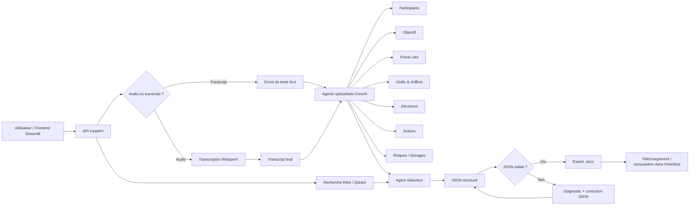

# Agent de compte-rendu de réunion

Assistant IA destiné à transformer une réunion audio/vidéo ou un transcript brut en compte-rendu structuré, exportable en Word (.docx), avec un workflow orienté agents spécialisés.

Le projet combine :
- un backend FastAPI,
- une interface Streamlit,
- un orchestrateur d'agents avec CrewAI,
- une étape de transcription audio via WhisperX,
- un moteur de recherche vectorielle Qdrant pour un éventuel contexte RAG,
- une génération de document Word à partir d'un JSON structuré.

## Vue d'ensemble

Le flux typique est le suivant :
1. L'utilisateur charge un fichier audio ou fournit un transcript.
2. Le backend lance la transcription (si nécessaire).
3. Une série d'agents spécialisés analyse le transcript : participants, objectif, points clés, outils/chiffres, décisions, actions, risques, etc.
4. Un agent rédacteur consolide les analyses en un objet JSON valide.
5. Le JSON est validé puis converti en document Word (.docx).
6. Le frontend affiche le résultat et permet éventuellement de corriger / réviser des sections.

Le projet est construit pour être exécutable en Docker, avec un backend et un frontend séparés.

## Fonctionnalités

- Analyse automatique de réunion à partir d'un transcript textuel
- Agents spécialisés pour :
  - participants
  - objectif
  - points clés
  - outils et chiffres
  - décisions
  - actions
  - risques / blocages
- Génération d'un compte-rendu au format JSON structuré
- Validation automatique du JSON
- Correction automatique du JSON lorsqu'il est cassé
- Génération de document Word (.docx)
- Support de la transcription audio avec WhisperX
- Possibilité d'utiliser un moteur RAG/Qdrant pour enrichir les recherches contextuelles
- Interface utilisateur web Streamlit

## Stack technique

- Python 3.11
- FastAPI
- Streamlit
- CrewAI
- Ollama (modèles LLM)
- WhisperX pour la transcription audio
- Qdrant pour le stockage vectoriel / RAG
- python-docx pour l'export Word
- Docker / Docker Compose

## Architecture du projet

```text
agent_compte-rendu/
├── README.md
├── requirements.txt
├── docx_export.py
├── gemma4.txt
├── venv/
├── image_docker_agent/
│   ├── docker-compose.yml
│   ├── backend/
│   │   ├── main.py
│   │   ├── Dockerfile
│   │   ├── requirements_backend.txt
│   │   ├── API_routes/
│   │   ├── agents/
│   │   ├── engines/
│   │   ├── transcription_tools/
│   │   ├── schemas.py
│   │   ├── job_store.py
│   │   └── docx_export.py
│   └── frontend/
│       ├── app.py
│       ├── Dockerfile
│       ├── requirements_frontend.txt
│       ├── api_client.py
│       ├── pages/
│       ├── plugins/
│       ├── ui/
│       └── utility/
└── ...
```

## Flux de traitement (Mermaid)



## Détails fonctionnels

### Backend

Le backend FastAPI expose plusieurs modules :

- `/agent` : orchestration des agents et génération du compte-rendu
- `/rag` : recherche dans les collections Qdrant
- `/transcribe` : transcription audio, file d'attente et traitement WhisperX

### Frontend

Le frontend Streamlit permet :
- de lancer une analyse sur un transcript ou un audio
- de configurer les agents activés
- de suivre la progression des jobs
- de consulter les résultats section par section
- de réviser les sections
- de télécharger le document final en .docx

### Fichier utilitaire racine

Le fichier `docx_export.py` est un utilitaire de conversion d'une sortie JSON en document Word. Il interprète un objet JSON produit par l'agent rédacteur, puis construit un document `.docx` avec les sections classiques d'un compte-rendu :
- titre et date
- participants
- objectif
- points clés
- outils et chiffres
- décisions
- actions
- blocages

## Prérequis

Avant de lancer le projet, il faut disposer de :

- Docker et Docker Compose
- un accès à un modèle Ollama (par défaut `gemma4:e4b`)
- éventuellement un service Qdrant
- un accès réseau pour le service WhisperX et Ollama
- un dossier partagé audio si vous utilisez le traitement audio sur un serveur distant

## Configuration

Le fichier `image_docker_agent/docker-compose.yml` définit plusieurs variables d'environnement.

Variables importantes :
- `OLLAMA_HOST` : URL du serveur Ollama
- `DEFAULT_LLM` : modèle LLM par défaut
- `CONTEXT_SIZE` : taille de contexte LLM
- `TEMPERATURE` : température de génération
- `WHISPERX_SERVICE_ADDRESS` : service WhisperX (si utilisé)
- `QDRANT_HOST` / `QDRANT_PORT` : accès à Qdrant
- `SHARED_AUDIO_DIR` : dossier partagé pour les fichiers audio

## Démarrage rapide

### Option 1 : Docker Compose (recommandée)

Depuis le dossier du projet :

```bash
cd image_docker_agent
sudo docker compose up --build
```

Le projet démarre alors avec :
- frontend sur `http://localhost:8502`
- backend sur `http://localhost:8003`

Pour vérifier la santé du backend :

```bash
curl http://localhost:8003/agent/health
```

### Option 2 : exécution locale Python

Installer les dépendances :

```bash
pip install -r requirements.txt
```

Puis lancer le backend et le frontend séparément selon votre environnement.

## Utilisation

### 1. Ouvrir l’interface Streamlit

Aller sur :

```text
http://localhost:8502
```

Dans l'interface :
- sélectionner le modèle LLM,
- fournir le transcript ou charger un fichier audio,
- choisir les agents activés,
- lancer l'analyse,
- récupérer le compte-rendu JSON et le document Word.

### 2. Utiliser l'API backend directement

Quelques endpoints utiles :

#### Analyse complète
```http
POST /agent/analyze
```

Corp de requête :
```json
{
  "transcript": "Texte complet de la réunion ...",
  "llm": {
    "model_name": "gemma4:e4b",
    "base_url": "http://localhost:11434"
  },
  "agent_config": {
    "participants": true,
    "objectif": true,
    "points_cles": true,
    "outils_chiffres": true,
    "decisions": true,
    "actions": true,
    "risques": true,
    "redacteur": true
  },
  "verbosity": "concis",
  "user_input": ""
}
```

#### Vérification de l'état d'un job
```http
GET /agent/jobs/{job_id}
```

#### Génération du document Word
```http
POST /agent/docx/build
```

Le corps attend un JSON brut produit par le rédacteur, puis renvoie un fichier `.docx`.

#### Recherche RAG
```http
POST /rag/search
```

#### Transcription audio
```http
POST /transcribe/processing_audio
```

## Structure de sortie JSON

Le rédacteur produit un objet JSON conforme au schéma attendu, avec des clés typiques comme :

```json
{
  "titre": "Compte-rendu de réunion",
  "date": "2026-08-26",
  "participants": ["Alice", "Bob", "Charlie"],
  "absents": ["David"],
  "objectif": "Recenser les points importants et les actions à venir.",
  "points_cles": [
    "Analyse de la situation actuelle",
    "Validation du plan de travail"
  ],
  "outils_et_chiffres": [
    {
      "outil": "Outil X",
      "chiffres_associes": ["12 tests", "3 blocages"]
    }
  ],
  "decisions": [
    "Le projet continue avec le plan A"
  ],
  "actions": [
    {
      "action": "Mettre à jour le planning",
      "responsable": "Alice",
      "echeance": "15/09/2026"
    }
  ],
  "points_de_blocage": [
    "Risque de dépendance sur un fournisseur externe"
  ]
}
```

## Déploiement et environnement

Le projet est prêt pour une exécution en conteneurs Docker. Le fichier `docker-compose.yml` configure :
- un service `backend` sur le port `8003`
- un service `frontend` sur le port `8502`
- un réseau interne `compte_rendu_net`
- des connexions externes vers des services partagés (`shared_services_net`, `qdrant_net`)

Pour un environnement plus riche, il est nécessaire de s'assurer que les services suivants sont disponibles :
- Ollama
- Qdrant
- un service WhisperX si le flux de transcription audio est activé

## Dépannage

### Le backend ne démarre pas
Vérifier :
- la présence d'un serveur Ollama accessible
- la configuration des variables d'environnement
- les logs Docker

```bash
docker compose logs -f backend
```

### Le frontend ne charge pas
Vérifier :
- que le backend est bien démarré
- que l'URL `BACKEND_URL` est correcte
- que le port 8502 est bien exposé

### Le JSON produit n'est pas valide
Le backend contient une logique de validation et de réparation automatique. Si le JSON est cassé, il est diagnostiqué avec position de ligne/colonne puis corrigé par un agent dédié.

### La transcription audio échoue
Vérifier :
- que `ffmpeg` est bien installé dans l'image Docker
- que le format audio est compatible
- la configuration de `WHISPERX_SERVICE_ADDRESS`
- les logs de transcription

## Bonnes pratiques

- Utiliser des modèles bien adaptés à votre environnement et à votre budget.
- Vérifier la cohérence de la sortie JSON avant export Word.
- Se tenir à jour sur les dépendances Python du projet.
- Préparer un dossier de fichiers audio propre pour les traitements de transcription.
- Maintenir les services Ollama/Qdrant accessibles en production.

